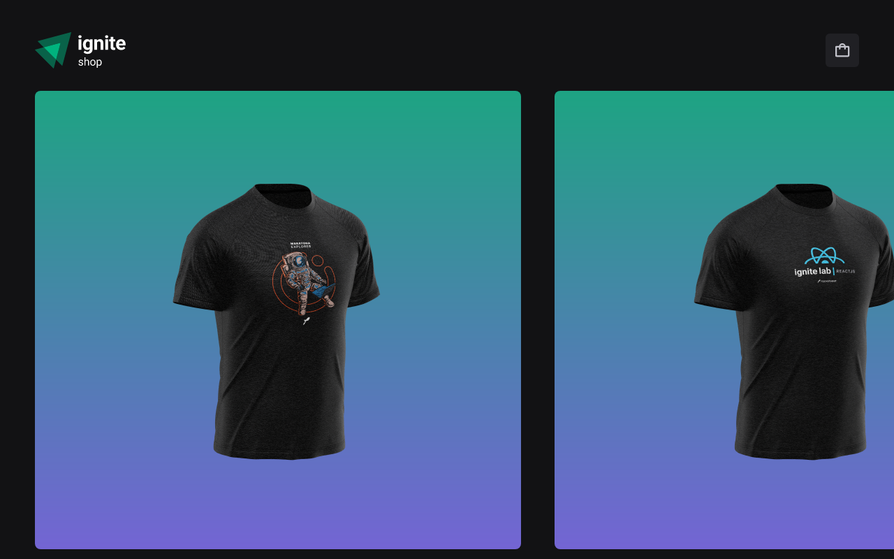

<h1 align="center">
    <a href="#"> Ignite Shop </a>
</h1>

<p align="center"> Sua loja digital.. </p>

<h4 align="center"> 
	 Status: Em desenvolvimento...
</h4>

<p align="center">
 <a href="#-about">About</a> •
 <a href="#-layout">Layout</a> • 
 <a href="#-tech-stack">Tech Stack</a> • 
 <a href="#-author">Author</a> • 
 <a href="#-license">License</a>

</p>



## 💻 Sobre:

O aplicativo que desenvolvI é uma loja de roupa fictício, conhecido como ignite shop.
Neste desafio foram abordados os seguintes temas:

- Next;
- Routes;
- components;
- Props;
- hooks;
- context;
---
## 🎨 Layout

O layout da aplicação está disponível no Figma:

<a href="https://www.figma.com/file/kBmbBqHWIf5Ww9ydgb5KK8/Ignite-Shop-2.0-(Copy)?node-id=0%3A1">
  
</a>

<br>
<br>

## 🚀 Como executar o projeto.

Este projeto é divido em uma parte:
1
💡O Backend deve estar rodando em sua máquina para que o frontend seja reenderizado.
)

### Pré-requisitos

Antes de começar, você vai precisar ter instalado em sua máquina as seguintes ferramentas:
[Git](https://git-scm.com), [Node.js](https://nodejs.org/en/). 
Além disto é bom ter um editor para trabalhar com o código como [VSCode](https://code.visualstudio.com/)

<br>

#### 🎲 Rodando a aplicação (Frontend) 

```bash

# Clone este repositório
$ https://github.com/JoaoAlberto20/ignite-shop.git

# Acesse a pasta do projeto no terminal/cmd
$ cd + sua pasta + git clone git@github.com:JoaoAlberto20/ignite-shop.git

# Instale as dependências com:
$ npm install

# Rode a aplicação em modo de desenvolvimento:
$ npm run dev

# O servidor inciará na porta:3000 - acesse <   localHost:3000
```
---

## 🛠 Tecnologias

Este projeto foi desenvolvido com as seguintes tecnologias:

- Next
- Stitches
- Striper
- Radix
- Context API
- TypeScript

---
## Deploy do projeto.
https://ignite-shop-ruby.vercel.app/

---
## 📝 License

This project is under the license [MIT](./LICENSE).

Made with ❤️ by João Alberto np da silva  [Get in Touch!](https://www.linkedin.com/in/joaoalbertosvcode)

---